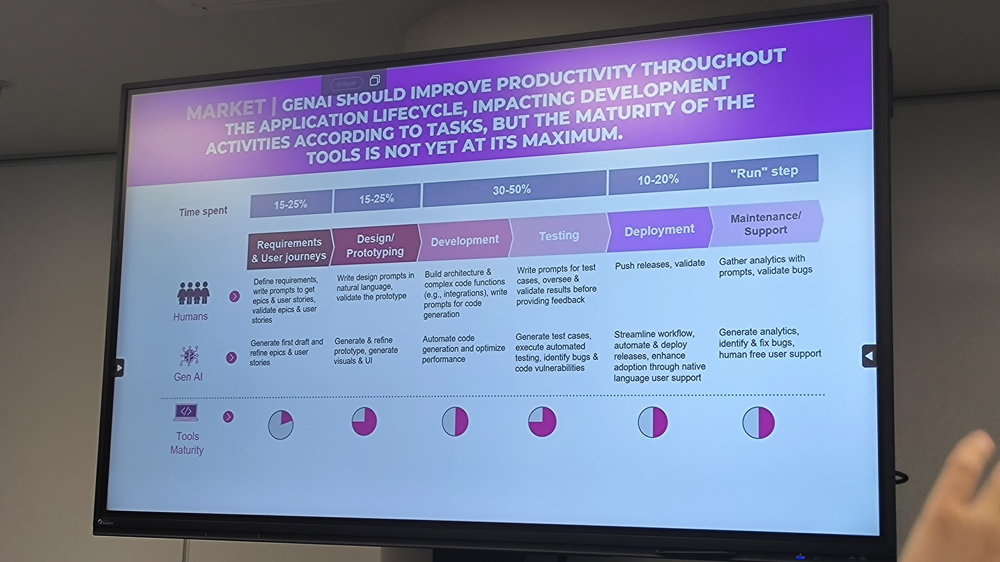

The talk focused on the transition from the "hype" of GenAI to the practical realities of execution. While there is significant potential, the bank is facing friction regarding legacy code migration and developer expectations. The key takeaway is that GenAI is not "magic"—it is a tool that currently requires significant human oversight and context-specific training.

## The "Magic" Misconception

- **Developer Disappointment:** Many developers approach GenAI expecting immediate, magical results. When the tools fail to deliver perfect code instantly, it leads to disillusionment.
- **Text vs. Code:** The speaker emphasized that code is fundamentally different from text generation. It requires rigorous maintenance and cannot simply be generated and forgotten.

## Practical Wins

While complex migrations remain a challenge, BP is successfully leveraging off-the-shelf LLMs to handle repetitive tasks across the productivity lifecycle.

The current workflow effectively splits labor between AI generation and human validation:

- **Requirements & Design:** AI is used to generate the **first drafts** of epics, user stories, and UI prototypes, which humans then refine and validate.
- **Development & Testing:** Instead of architecting complex systems, the AI focuses on **automating standard code generation**, optimizing performance, and generating test cases to identify vulnerabilities.
- **The "Human-in-the-Loop" Reality:** The bank’s model (see attached slide) relies heavily on a verification loop: AI generates the draft or code, and developers intervene to validate results, write prompts for complex integrations, and oversee architecture.

## Exploring Use Cases

### Development Use Cases

**Design & Testing**
- AI-assisted generation of user stories and rapid prototyping
- Creation of functional test cases and manual or automatic execution of these tests

**Augmented Developer**
- AI-powered code generation and optimization across multiple programming languages (JS, C++, COBOL, etc.)
- Creation of associated unit tests to ensure the required quality level

**Version Upgrading**
- Upgrade of software components to newer versions of the same technology
- Reduction of tech debt from obsolete components (e.g., Angular 9)

**Code Migration**
- Rewriting of source code using a new technology
- Preservation of the original functionality without modification

**Documentation reverse-engineering**
- Detailed analysis of existing systems to understand and document their functioning and their architecture

### Operations Use Cases

**Knowledge Mining & Documentation Generation**
- Enrichment of documentation databases by cross-referencing incidents, changes, and application data
- Automatic creation of application documentation (e.g., flow mapping)

**Enhanced Support & Corrective Maintenance**
- Automated responses to recurring questions already covered in technical documentation
- AI-assisted ticket generation filtering of false incidents (~30%), and improved ticket assignment

**Predictive Maintenance & Performance Optimization**
- AI-driven analysis of application logs and performance data to identify optimization opportunities and predict service limits
- Intelligent automation of CI/CD pipelines, QoS monitoring, and performance scaling for continuous improvement

**Robo-Advisory for Production & Application Maintenance**
- Automated log analysis for end-to-end incident diagnosis across services, code, and data
- AI-driven resolution strategies and automatic incident remediation

**Risk & Security Analysis**
- Behavioral analysis & access management to control user activities
- AI-enhanced security through correlation analysis, fraud detection, and vulnerability identification

## The Struggle with Legacy Migration

- **Current Limitations:** The bank has found current off-the-shelf LLMs disappointing for specific heavy-lifting tasks, particularly **code migration and version upgrading**.
- **Context Gap:** The models struggle with the specific nuances of the bank’s legacy codebase (specifically **Java and COBOL**). The lack of context leads to hallucinations or inefficient code during upgrades.
- **Latency:** Evaluating the results of GenAI takes time, slowing down the workflow loop and making it difficult to find the right efficiency balance.

To address the shortcomings of generic models, Groupe Banque Populaire plans to **train their own LLM next year**.

The goal is to create a model that deeply understands their specific internal context, architecture, and legacy languages.
They are shifting focus toward using LLMs for architectural visibility—specifically understanding how applications and dependencies are linked, and modeling potential defects based on historical issue data.

## The Future of Developers

- **No Replacement:** The bank stated clearly that they **do not plan to replace developers**.
- **Trust Issues:** There is not enough "faith" in the current autonomy of AI to let it run unchecked. The focus remains on human-in-the-loop workflows.
